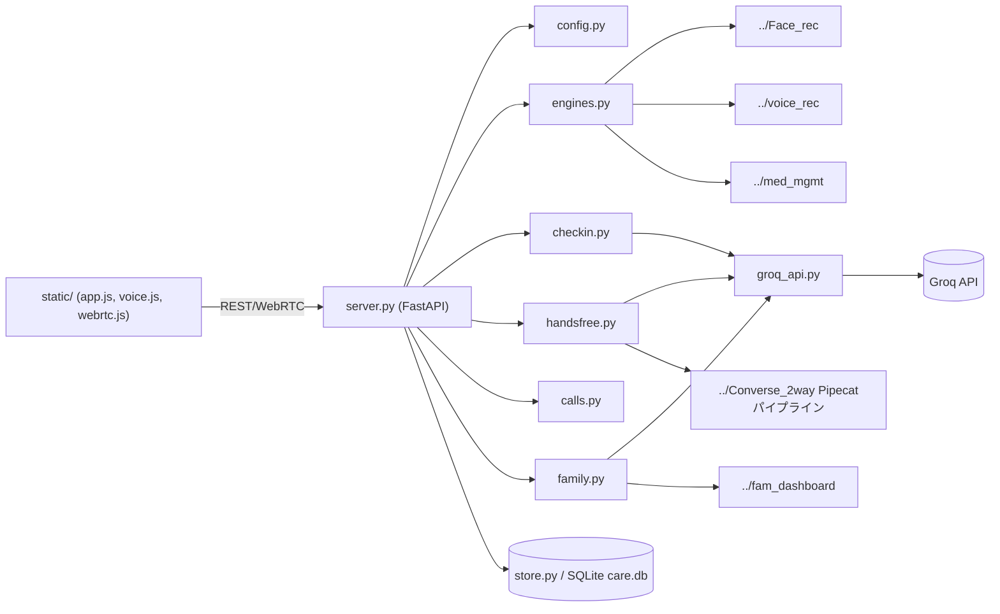
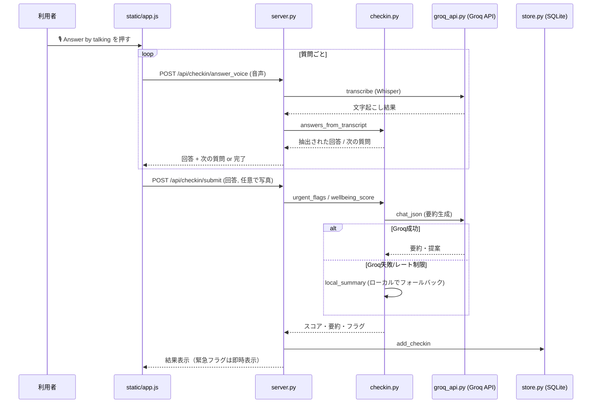

# Elder Care Assistant プロジェクトドキュメント

> 本ドキュメントは [Zenn記事「Anatom-AI」](https://zenn.dev/jcs300/articles/5511ded660f522) の構成
> （はじめに → プロジェクト概要 → 使用例 → System architecture → 参考リンク）を
> テンプレートとして、本リポジトリ (`eld_care_assist`) の内容に合わせて作成したものです。

## 1. はじめに

**Elder Care Assistant** は、高齢の利用者を見守るための機能を一つのブラウザ画面に統合した
Webアプリケーションです。日々のコンディションを「話しかけるだけ」で記録できる音声チェックイン、
話し相手になるハンズフリー会話、顔・声からの感情推定、服薬リマインダー、そして家族・介護者向けの
引き継ぎレポートを、単一のFastAPIサーバー（`python run.py` / `http://127.0.0.1:8100`）から提供します。
英語・日本語の両方に対応しています。

このリポジトリは単体で完結しているのではなく、同じ親ディレクトリにある姉妹アプリ
（`Face_rec` / `voice_rec` / `med_mgmt` / `Converse_2way`）の成果物を**再実装せずに再利用する**
「統合ハブ」として設計されている点が最大の特徴です。

## 2. プロジェクト概要

### 2.1 概要

従来、見守りに必要な機能（顔・声の感情分析、服薬管理、音声対話）は個別アプリとして分散していました。
Elder Care Assistant はこれらを1つの画面から呼び出せるようにし、次の5つの体験を提供します。

| 機能 | 内容 |
|---|---|
| Today（ホーム） | 本日のwellbeingスコア、直近チェックイン、服薬状況、14日間のトレンド |
| Check-in | 睡眠・食欲・痛み・元気・気分・孤独感を1問ずつ声で聞き取る日次チェックイン |
| Talk | テキスト／単発マイク／ハンズフリーで話せる雑談相手。発話は声のトーン分析用に保存 |
| Medicines | 本日の服薬（服用/スキップ）、飲み忘れアラート、処方箋の写真/テキスト読取による追加 |
| Report | その日のチェックイン・会話・服薬記録を「変わりない／気になる点／要注意」でまとめたレポート、CSV出力 |

### 2.2 対象ユーザー

- **高齢の利用者本人** — 話しかける・答える側。ボタン操作なしで会話的にチェックインできる
- **家族・介護者** — Todayタブやレポート、家族向けダッシュボード連携で状態を確認する側
- （間接的に）**遠隔から見守る家族** — `family.py` 経由で14日間のロールアップと要約を受け取る

## 3. 使用例

典型的な1日の使われ方は以下のようになります。

1. 利用者が **🎙 Answer by talking** を押し、睡眠・食欲・痛み・元気・気分・孤独感について
   1問ずつ話して答える。会話が終わると、聞き取った内容がフォームに自動反映され、
   介護者がその場で確認・修正できる。
2. 任意で顔写真を撮る、または本人の言葉を追加する。これらと回答から
   **0〜100点のwellbeingスコア**、平易な言葉での要約、気になる点、
   医療行為ではない簡単な提案が生成される。
3. 日中、**🎙 Hands-free conversation** で話し相手になり、雑談する。
   会話終了後「Save conversation record」を押すと、気分・要約・注目点のメモが記録される。
4. 服薬タブで本日の薬を服用/スキップとして記録。飲み忘れがあればアラートが出る。
   新しい処方箋は写真を撮るかテキストを貼るだけで登録できる。
5. 一日の終わりに **Report** タブで、その日のチェックイン・会話・服薬記録が
   「How they have been / Worth watching / Needs attention」の3区分でまとまり、CSVでも出力できる。

胸の痛み・呼吸困難・転倒・めまいなど緊急性の高い発言があった場合は、
上記のAI処理を待たずハードコードされたルールで即座にフラグが立ちます（4.6節）。

## 4. System architecture

### 4.1 設計の要点

- **1つの統合ハブ、機能はすべて姉妹アプリから再利用** — 顔感情・声感情・服薬管理・
  ハンズフリー音声パイプラインは自前で実装せず、隣接リポジトリを動的インポートして使う
- **AI呼び出しは `groq_api.py` に一元化** — チャット、Vision（処方箋読取）、
  Whisper（音声認識）をすべてGroq API経由で行い、レート制限時は自動リトライする
- **安全性はネットワークに依存させない** — 緊急症状の検知はAIではなくハードコードのルール
- **生データは基本的に保持しない** — 写真や音声はメモリ内処理で捨て、抽出結果
  （ラベル・テキスト・タイムスタンプ）のみをSQLiteに保存する。唯一の例外が会話音声（4.6節）

### 4.2 コンポーネント構成

```
run.py            起動（依存チェック → server.serve() → ブラウザを開く）
  └─ server.py    FastAPIアプリ本体。全モジュールを統合するハブ
       ├─ config.py     .env読込、モデル設定、姉妹アプリのパス解決
       ├─ engines.py    姉妹アプリのモデル/ストアの遅延ローダー
       │    ├─ ../Face_rec    顔感情（YuNet + FER+, ONNX）
       │    ├─ ../voice_rec   声感情（HuBERT, 日本語, 1.2GB）
       │    └─ ../med_mgmt    服薬ストア + 処方箋リーダー
       ├─ groq_api.py   Groq API呼び出し（chat / vision / whisper）
       ├─ checkin.py    質問定義・聞き取り・採点・緊急ルール・要約
       ├─ handsfree.py  ../Converse_2way のPipecatパイプラインへのブリッジ
       ├─ calls.py      会話中の「電話して」発話検知 → tel:リンク生成
       ├─ family.py     ../fam_dashboard 連携（14日ロールアップ・要約）
       ├─ democlock.py  デモ用の時刻操作（服薬リマインダー等の検証用）
       └─ store.py      SQLite永続化（residents / checkins / conversations /
                         messages / contacts / call_log / conv_records）
  └─ static/       フロントエンド（index.html, app.js, voice.js, webrtc.js）
```



### 4.3 API仕様（Request/Response）

`server.py` は次のREST APIを提供します（主なもの）。

| 分類 | エンドポイント | 概要 |
|---|---|---|
| ヘルス/居住者 | `GET /api/health`, `GET/POST /api/residents` | 稼働確認、利用者登録・取得 |
| チェックイン | `GET /api/checkin/questions`, `POST /api/checkin/photo`, `POST /api/checkin/voice*`, `POST /api/checkin/answer_voice`, `POST /api/checkin/submit`, `GET /api/checkin/history` | 質問取得、写真/音声チェックイン、聞き取り結果の反映、確定、履歴 |
| 会話 | `POST /api/conversation/start`, `GET/POST /api/conversation/{cid}/messages,say,say_audio,voice/offer,analyze_voice,voice_summary,record` | 会話開始、発話（テキスト/音声）、WebRTCオファー、声のトーン分析、記録保存 |
| 連絡・通話 | `GET /api/contacts`, `POST /api/contacts`, `POST /api/calls/{contact_id}/log` | 連絡先管理、電話発信ログ |
| 服薬 | `GET /api/medications`, `GET /api/medications/today`, `POST /api/medications/dose,confirm_voice,extract_text,extract_photo,save` | 服薬一覧、本日分、服用記録、処方箋のテキスト/写真からの登録 |
| レポート/家族 | `GET /api/report`, `GET /api/family/overview,timeline,digest`, `GET /api/export` | 日次レポート、家族向けロールアップ・要約、CSV出力 |
| デモ | `GET/POST /api/demo/clock` | デモ用の現在時刻オフセット設定 |

代表的な例として、チェックインの音声聞き取り（`POST /api/checkin/answer_voice`）は
**Request**（発話の音声データ、これまでの質問インデックス・回答履歴）を受け取り、
**Response**（Whisperによる文字起こし、抽出された回答、次の質問または完了フラグ）
を返します。会話系エンドポイントも同様に、音声/テキストの入力に対して
応答テキストと（必要に応じて）音声URL・推論根拠を返す構造です。

### 4.4 実行シーケンス（チェックインの例）



ハンズフリー会話（Talk）も基本構造は同じですが、聞き取り・応答生成は
`../Converse_2way` のPipecatパイプラインが担い、`handsfree.py` がその中の
2箇所のフック（メッセージ保存先・システムプロンプト）だけをこのアプリ向けに
差し替えて再利用します。チェックイン中の音声対話もこの同じパイプラインの上で、
インタビュー用プロンプトに切り替えて動いています。

### 4.5 利点

- **安定性** — チェックインのスコア・要約はGroq API障害時もローカルで計算されるため、
  利用者の回答がAPIエラーで失われることがない
- **拡張性** — 姉妹アプリ（顔感情・声感情・服薬・音声対話）は差し替え可能な部品として
  `engines.py` の遅延ローダー越しに接続されており、モデルや実装の更新が本体に影響しにくい
- **保守性** — AI呼び出しが `groq_api.py` に一元化されているため、モデル変更やレート制限対応を
  1か所で管理できる
- **直感性** — チェックインも会話もボタン操作なしで進められ、聞き取った内容は
  後からフォーム上で確認・修正できるため、AIの誤認識が記録に残るリスクを抑えている

### 4.6 安全設計・フォールバック

- **緊急症状はAIではなくハードコードのルールで検知**（胸痛・呼吸困難・転倒・めまい）。
  Groq APIが未応答・レート制限・誤動作していても、安全に関わる判定はネットワークに依存しない
- **要約生成（Groq）が失敗した場合でもチェックインは保存される** — スコアと注意フラグは
  ローカルで計算され、回答から平易な要約が組み立てられる（`local_summary`）
- **Groqのレート制限（429）は自動リトライ**され、短い待機で復旧する
- **写真は一度きりの評価に使うだけで保存しない** — 顔感情はメモリ内で処理して破棄し、
  wellbeingスコアへの重みも25%に留めている（本人の回答を優先する設計）
- **音声が唯一ディスクに保存されるのは会話（Talk/チェックインの発話）のみ**
  （`data/audio/<conversation_id>/`）。これは声のトーン分析用モデルが1体分のWAVを
  必要とし、かつ会話中に毎ターン重い推論を挟むと応答が重くなるため、
  分析は「Analyse voice tone」ボタンで事後的に行う設計になっている

### 4.7 現時点の制約

- **診断ではない** — 発言と観察結果を提示し、判断は人間に委ねる。プロンプト上も
  病名の断定や医療・服薬アドバイスは禁止されている
- **日本語音声合成には日本語ボイスの追加インストールが必要**。無いと
  `speechSynthesis` が無音のまま失敗する（Edgeブラウザなら追加設定なしで動作）
- **声感情モデルは日本語専用**（XLSR → 日本語ASR → JTES）。英語の発話に対しては
  自信度の高い誤った結果を返すことがあるため、英語音声のトーン判定は参考情報に留めるべき
- **1枚の顔写真からの感情推定は根拠として弱い** — スコアへの重みは25%に制限
- **Groq無料枠のレート制限**により、混雑時は応答が数秒遅れることがある（自動リトライで吸収）

## 5. 技術スタック

| 分類 | 使用技術 |
|---|---|
| 言語 | Python（バックエンド）、JavaScript / HTML（フロントエンド） |
| Webフレームワーク | FastAPI + Uvicorn |
| AI API | Groq API（`llama-3.3-70b-versatile` ほか、Vision・Whisperモデルを含む） |
| 画像処理 | OpenCV, onnxruntime, Pillow（顔感情のONNXモデル推論） |
| 音声対話 | pipecat-ai（WebRTC, Silero VAD, Groq）— `Converse_2way` から再利用 |
| データストア | SQLite（`store.py`, `data/care.db`） |

## 6. ディレクトリ構成

```
eld_care_assist/
├─ run.py         起動スクリプト（依存確認・機能有無レポート・サーバー起動）
├─ server.py      FastAPIアプリ本体・全APIエンドポイント
├─ config.py      .env読込・モデル設定・姉妹アプリのパス解決
├─ engines.py     姉妹アプリのモデル/ストアの遅延ローダー
├─ groq_api.py    Groq API呼び出し（chat / vision / whisper）
├─ checkin.py     チェックインの質問・採点・緊急ルール・要約
├─ handsfree.py   Converse_2wayのPipecatパイプラインへのブリッジ
├─ calls.py       会話中の「電話して」発話検知
├─ family.py      家族向けダッシュボード連携
├─ store.py       SQLite永続化
├─ democlock.py   デモ用の時刻操作
├─ data/
│  ├─ care.db     SQLite本体
│  └─ audio/<conversation_id>/   会話音声（唯一ディスクに保存される音声）
└─ static/        フロントエンド（index.html, app.js, voice.js, webrtc.js）
```

姉妹アプリ（親ディレクトリ配下、本リポジトリには含まれない）:

| 姉妹アプリ | 提供する機能 |
|---|---|
| `../Face_rec` | 顔感情認識（YuNet + FER+, ONNX, CPU） |
| `../voice_rec` | 声感情認識（HuBERT, 日本語, 1.2GB） |
| `../med_mgmt` | 服薬ストア・処方箋読取 |
| `../Converse_2way` | ハンズフリー音声対話パイプライン |
| `../fam_dashboard` | 家族向けダッシュボードのデータソース |

## 7. セットアップ

```bash
python run.py               # サーバー起動 + ブラウザを開く
python run.py --check       # 起動せず設定・依存関係だけ確認
python run.py --port 8200   # 別ポートで起動（他の姉妹アプリは8000〜8002を使用）
```

Groq APIキーはリポジトリルート共有の `.env` に設定します。

```
GROQ_API_KEY=gsk_your_key_here
```

モデルは `config.py` で選択され、`.env` の `ECA_TEXT_MODEL` / `ECA_VISION_MODEL` /
`ECA_WHISPER_MODEL` で上書きできます。APIキーや任意モデルが無くても起動は可能で、
どの機能が使えないかを起動時に表示します。ハンズフリー機能には
`pip install "pipecat-ai[webrtc,groq,silero]"` が必要で、マイク利用には
`localhost` またはHTTPSが必須です（ブラウザ側の制約）。

## 8. 参考リンク

- 参考にした記事構成: [Zenn「Anatom-AI」](https://zenn.dev/jcs300/articles/5511ded660f522)
- 本リポジトリの README: [README.md](../README.md)
